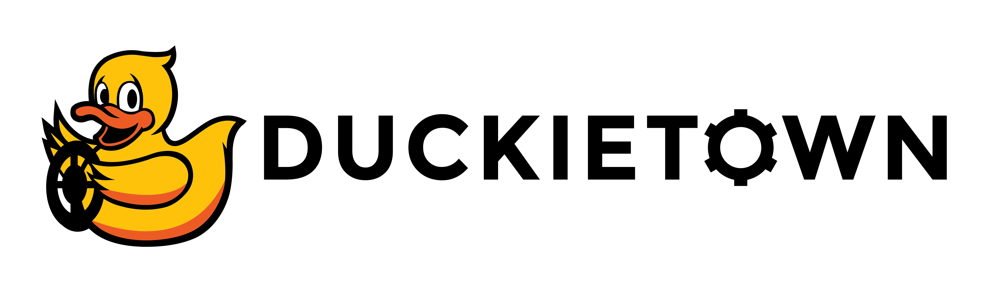

<p align="center">
<a href="https://duckietown.com"></a>
</p>

# Learning Experience (LX): ROS 2 Middleware on the Duckiedrone

`Software: ente`; `Hardware: DD24-B`

A Duckiedrone may collect sensor readings, estimate its state, and control motion concurrently. Dividing that work into independently testable components makes it easier to develop and diagnose, provided those components agree on how to exchange data. Robot Operating System 2 (ROS 2) supplies a graph of communicating nodes and shared interfaces for that purpose.

In this learning experience (LX), you will follow data through that graph, inspect its interfaces, then build and run a Python publisher and subscriber. The local activities make each step observable before you apply the same tools to Duckiedrone telemetry.

## Intended learning outcomes

After completing this LX, learners will be able to:

1. Describe the ROS 2 graph, client-library, and middleware layers, and explain how nodes, topics, messages, services, and parameters fit together in a robot.

2. Explain how middleware discovery and `ROS_DOMAIN_ID` help ROS 2 nodes find compatible participants.

3. Create, build, source, and inspect an `ament_python` ROS 2 package with `colcon` and `ros2`.

4. Write and run Python publisher and subscriber nodes with `rclpy` and `std_msgs/msg/String`.

5. Explain how the Duckietown Postal Service (DTPS), ROS 2 bridges, and the MAVROS bridge between the flight controller and ROS 2 make sensor data from a current Duckiedrone visible to application nodes.

## Run this LX

Follow the Duckietown Manual's [LX General Instructions](https://docs.duckietown.com/ente/opmanual-dd24/50-learning-experiences/lx-general-procedure.html) to open this LX in a prepared environment. The notebooks provide the topic-specific activities; the prerequisites below describe the local setup.

## Notebooks

Start with [Notebook 1](./notebooks/1-robot-operating-system-2-graph-and-software-layers.ipynb) to understand the roles of the graph and software layers before the data-path, interface, and discovery chapters. Those chapters explain how components agree on what to exchange and find each other. The workspace and build chapters make your source discoverable as runnable executables. Graph inspection gives you evidence for the publisher, subscriber, and diagnosis activities that follow; remapping then shows how to reuse the same nodes with different names. Duckiedrone inspection is optional for the local exercises. Individual notebooks can also be used when the prerequisites below are available.

| # | Notebook | Description |
| --- | --- | --- |
| 1 | [Notebook 1](./notebooks/1-robot-operating-system-2-graph-and-software-layers.ipynb) | Explain the ROS 2 graph, software layers, interfaces, and distributed communication model |
| 2 | [Notebook 2](./notebooks/2-ros-2-data-paths-and-duckiedrone-integration.ipynb) | Explain modular ROS 2 data paths and the Duckietown Postal Service (DTPS), sensor, PX4 autopilot firmware, MAVLink flight-controller messaging protocol, and MAVROS bridge boundaries |
| 3 | [Notebook 3](./notebooks/3-ros-2-nodes-topics-and-interfaces.ipynb) | Identify ROS 2 nodes, topics, messages, message contracts, services, actions, and parameters |
| 4 | [Notebook 4](./notebooks/4-ros-2-discovery-domains-and-names.ipynb) | Explain discovery, Zenoh, domains, names, and the relevant ROS 1 comparison |
| 5 | [Notebook 5](./notebooks/5-ros-2-workspaces-and-packages.ipynb) | Identify the exercise workspace and an `ament_python` package's source files |
| 6 | [Notebook 6](./notebooks/6-build-and-discover-a-ros-2-package.ipynb) | Build `ros2_pubsub`, source its overlay, and confirm package discovery |
| 7 | [Notebook 7](./notebooks/7-inspect-a-local-ros-2-graph.ipynb) | Connect graph endpoints to received messages using `ros2` inspection tools |
| 8 | [Notebook 8](./notebooks/8-inspect-a-duckiedrone-ros-2-graph.ipynb) | Inspect telemetry interfaces to choose a subscriber's topic, type, and delivery settings |
| 9 | [Notebook 9](./notebooks/9-ros-2-node-lifecycles-and-publishers.ipynb) | Connect callbacks and timers to the publisher's payload and rate |
| 10 | [Notebook 10](./notebooks/10-ros-2-subscribers-and-diagnosis.ipynb) | Run the local subscriber and diagnose a missing message in a fixed order |
| 11 | [Notebook 11](./notebooks/11-ros-2-names-and-remapping.ipynb) | Start local nodes with distinct names and topic remappings |

## Prerequisites

Complete the Duckietown Manual's [Initial Setup](https://docs.duckietown.com/ente/duckietown-manual/10-setup/setup-introduction.html) so Docker and the Duckietown Shell (`dts`) are installed and configured on the base station.

Use `dts code editor` to read and edit this LX. Run local `ros2` and `colcon` commands in the supplied ROS 2 exercise terminal so they use its installed distribution and workspace. The browser editor and exercise runtime have separate roles.

### Choose the terminal

| Task | Where to run it |
| --- | --- |
| Read conceptual notebooks and edit exercise files | `dts code editor` or another editor |
| Run local `ros2`, `colcon`, publisher, and subscriber exercises in the local-practice notebooks | The supplied ROS 2 exercise terminal |
| Open a physical SSH or virtual Duckiedrone connection using the [Learning Experience (LX): Linux and Networking on the Duckiedrone](https://github.com/duckietown/lx-dd-linux-and-networking) | A base-station terminal, outside `dts code editor` |
| Run [Notebook 8](./notebooks/8-inspect-a-duckiedrone-ros-2-graph.ipynb) `docker ps` and `docker exec` commands | The Duckiedrone shell after connecting |
| Inspect the Duckiedrone ROS 2 graph | The `ros2-mavros` service-container shell entered by [Notebook 8](./notebooks/8-inspect-a-duckiedrone-ros-2-graph.ipynb) |

### ROS 2 foundations and local practice

[Notebook 1](./notebooks/1-robot-operating-system-2-graph-and-software-layers.ipynb) can be read before installing ROS 2. The supplied ROS 2 exercise environment provides `ros2`, `colcon`, and `COLCON_WS`, keeping the runtime and build tools together. All local activities run in this exercise environment. Interactive checkpoints require the notebook metadata supplied by `dts code editor` and a compatible Jupyter/IPython kernel with `ipywidgets` available. The metadata identifies the current notebook so the helper can load its matching questions.

[Notebook 5](./notebooks/5-ros-2-workspaces-and-packages.ipynb) introduces the workspace and is recommended before the build activity in [Notebook 6](./notebooks/6-build-and-discover-a-ros-2-package.ipynb). [Notebook 7](./notebooks/7-inspect-a-local-ros-2-graph.ipynb) uses two terminals. The publisher and subscriber activities use two node terminals plus a third observation terminal so the graph can be inspected while both processes run.

### Duckiedrone telemetry

[Notebook 8](./notebooks/8-inspect-a-duckiedrone-ros-2-graph.ipynb) requires a running Duckiedrone ROS 2 stack. It enters the configured `ros2-mavros` service shell to inspect graph metadata and telemetry while leaving flight control and configuration unchanged.

### Duckiedrone access

For Duckiedrone inspection, use a Duckiedrone you own or have permission to inspect and follow its physical SSH or local virtual connection procedure. The connection commands in the [Learning Experience (LX): Linux and Networking on the Duckiedrone](https://github.com/duckietown/lx-dd-linux-and-networking) start from a separate base-station terminal; the ROS 2 inspection starts after the Duckiedrone shell is open.

## Complete the ROS 2 exercise

The starter package lives in [packages/ros2_pubsub](./packages/ros2_pubsub/). After source changes, build it once to prepare the updated installed package:

```bash
source /opt/ros/${ROS2_DISTRO}/setup.bash
cd "${COLCON_WS}"
colcon build --packages-select ros2_pubsub
```

In each terminal, source the ROS 2 environment and workspace overlay so the tools can find that package:

```bash
source /opt/ros/${ROS2_DISTRO}/setup.bash
cd "${COLCON_WS}"
source install/setup.bash
```

[Notebook 6](./notebooks/6-build-and-discover-a-ros-2-package.ipynb) checks the installed location and executable registrations. The publisher and subscriber activities then connect those entry points to callbacks and received messages, giving you a way to verify the full local data path.

## Further reading

Each notebook's `Further reading` section is the primary reference for its lesson. This guide groups the course's sources:

- __ROS 2 concepts and tools:__ the [ROS 2 Jazzy documentation](https://docs.ros.org/en/jazzy/).

- __Data transport:__ the [Duckietown Postal Service documentation](https://docs.duckietown.com/ente/duckietown-manual/04-software-tools/duckietown-postal-service-dtps.html) and [Zenoh documentation](https://zenoh.io/docs/overview/what-is-zenoh/).

- __Flight-controller integration:__ the [MAVLink Guide](https://mavlink.io/), [MAVROS documentation](https://github.com/mavlink/mavros), and [PX4 Guide](https://docs.px4.io/main/).

- __Duckiedrone setup and operation:__ the [Duckiedrone DD24 manual](https://docs.duckietown.com/ente/opmanual-dd24/).

## For LX authors

Learner material is in `notebooks/` and `packages/`. Structural checks are in `tests/`, and the exercise image recipe is maintained in the paired `lx-dd-middleware-ros2-recipe` repository. Run the structural checks from the LX root:

```bash
python3 -m pytest tests/
```
